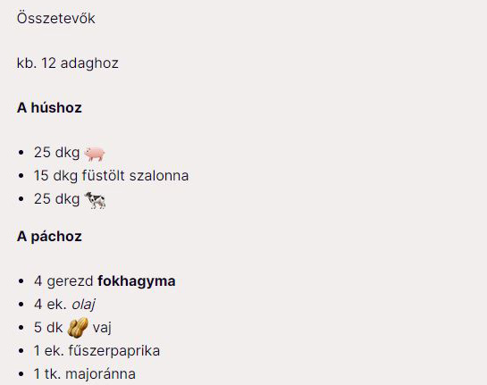

# Recipe Text Helper *(code snippet)*

## Introduction

RAS project made for [Blikk](https://blikk.hu).

# Description

This is just a **helper** (code snippet) for the recipe page of [Blikk](https://blikk.hu) , where we replace the recipe ingredients with images from an arbitrarily changeable list in our new template.

## Screenhots

## Technolgies

+ Javascript ES6
+ JQuery 3.4.1

## Setup

This is just a code snipet. Template required. You can use on Blikk.hu new template. 

## The project status 

Blikk new template will be available from may 2021.

## Created

2021

## License

[MIT](https://choosealicense.com/licenses/mit/)
